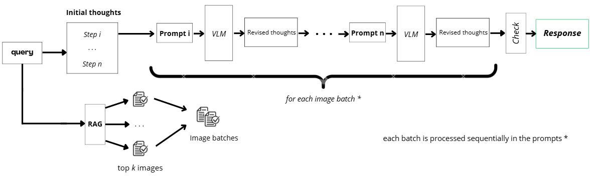

# README

  

  

## Multimodal Retrieval-Augmented Generation (RAG) for PDF Analysis

  

  

This repository contains two notebooks that showcase advanced methods for analyzing and extracting insights from PDF documents. These notebooks utilize a cutting-edge Multimodal Retrieval-Augmented Generation (RAG) system capable of :

  

  

- Efficiently indexing and retrieving information from texts, tables and images from PDFs.

  

- Parsing complex tables and layouts to extract structured data (Notebook 1).

  

- Employing logical reasoning and iterative query refinement for document-wide analysis (Notebook 2).

  

- Leveraging Vision-Language Models (VLMs) to interpret visual elements such as charts and figures.

  

- Generating precise and context-aware answers to user queries by combining textual and visual data.

  

  

These implementations are designed to handle multimodal inputs and provide enhanced capabilities for document understanding. Notebook 2 focuses on parsing and structured data extraction, while Notebook 1 emphasizes reasoning techniques for more complex and iterative analyses of multimodal documents.

 

### 1. **Hybrid System: RAT-Inspired ColQwen**

  

This notebook demonstrates a robust document analysis pipeline leveraging **ColQwen** model, designed for efficient multimodal information retrieval from complex documents. It is particularly suited for technical, financial, or analytical documents requiring iterative refinement of responses.


## System Pipeline


  
#### **Key Features:**

  

1.  **Iterative Chain-of-Thought Refinement**: The system uses step-by-step prompts to improve reasoning over retrieved content, ensuring logical consistency and accuracy.

  

2.  **Multimodal Batch Processing**: The model processes document images and text inputs in batches, optimizing performance and scalability for large documents.

  

3.  **Stepwise Pipeline Execution**:

- Index relevant pages using Retrieval-Augmented Generation (RAG).

- Process pages iteratively with prompts designed for retrieval and reasoning.

- Combine refined findings into a final validated response.

  

#### **Adaptations:**

Designed for comprehensive document-wide analysis. It excels in handling lengthy, detailed documents by iteratively refining answers across multiple steps.

 

This notebook provides a flexible and efficient framework for multimodal document analysis. Future enhancements could include integration with real-time data sources or extending the pipeline for multilingual document analysis.

  
  ### 2. **ColPali + OpenParse : Multimodal RAG for Q&A**

  

This notebook implements a multimodal RAG pipeline using:

  

  

-  **ColPali**: A pretrained information retrieval model for multimodal data.

  

-  **OpenParse**: For text and table parsing from PDFs.

  

-  **Qwen2-VL**: A Vision-Language Model for image-based analysis.

  

-  **Groq**: Accelerates inference processes.

  

  

#### Processing Pipeline:

  

1. Load and index PDF documents.

  

2. Retrieve relevant passages.

  

3. Extract and analyze pages with:

  

- Table structure recognition.

  

- Cell content extraction.

  

- Data formatting and cleaning.

  

4. Generate responses using parsed and visual data.

  

  

#### Features:

  

- Combines text and image analysis for structured and unstructured data.

  

- Focuses on numerical precision for charts and tables.

  

- Ideal for structured reports such as financial statements or technical manuals.

  

  
  

---

  

  

### Requirements

  

Ensure that you have the necessary dependencies installed. Refer to the `requirements.txt` file for detailed instructions.

  
### Setup

  

1. Clone the repository.

  

2. Install dependencies from `requirements.txt`:

  

```bash
!pip install -r requirements.txt
```

  

3. Obtain your **Groq API Key** and set it as an environment variable:

```bash
export GROQ_API_KEY="your_GroqApiKey"
```

  

4. Modify the notebook inputs:

  

- Update the `text_query` variable with your desired query (e.g., "Find key insights from the annual report").

  

- Specify the `pdf_path` variable with the path to your PDF document (e.g., "/path/to/document.pdf").

  

5. If you're using a notebook environment such as Google Colab, ensure that external tools like `poppler-utils` are installed. Run the following command in a notebook cell:

  

```bash
!apt-get install poppler-utils
```

  

6. Run the notebooks in your preferred environment.

  

  

---

  

  

### Technologies Used

  

-  **ColQwen**: Information retrieval model optimized for multimodal document processing.

  

-  **Qwen2VL**: Vision-Language Model for processing textual and visual inputs.

  

-  **OpenParse**: Parsing library for structured data extraction from PDFs.

  

-  **Groq**: API for accelerating inference processes in multimodal pipelines.

  

  

---

  

  

### Dependencies

  

This project relies on the following libraries and tools:

  

-  **Hugging Face Transformers** for model integration.

  

-  **OpenParse** for document parsing.

  

-  **pdf2image** and **PyPDF2** for PDF segmentation and processing.

  

  

---

  

  

### Resources

  

This project is inspired by the following research papers and frameworks:

  

  

- [Retrieval-Augmented Thoughts (RAT)](https://arxiv.org/pdf/2403.05313v1): A methodology for iterative reasoning and document-wide analysis.

  

- [ColPali: Retrieval-Augmented Generation](https://arxiv.org/pdf/2407.01449): A framework for multimodal information retrieval and reasoning.

  

  

---
